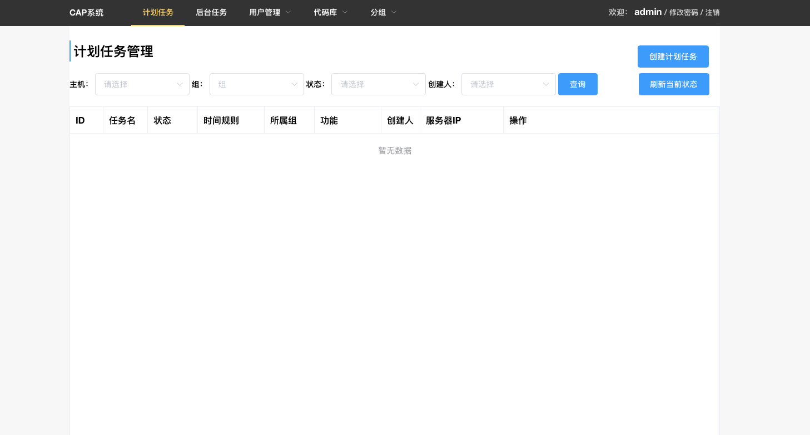

============
cap-python
============
***************
1.介绍
***************
基于 `crondeamon项目 <https://github.com/gongchangpy/crondeamon>`_ ，可以通过web管理计划任务及后台任务的项目， 其功能相当于supervisor+crontab， 基于twisted 及 django 框架。可以在web页面中完成计划任务或后台任务的管理。本项目源于世界工厂网研发团队,现仍在项目中服役.

***************
2.环境要求
***************
系统要求：

linux或者osx

python版本要求：

python>=2.7.x

pip

svn

git

注意：为了防止在安装过程中采坑，请预先把pip setuptools 更新到最新版。 更新命令：

pip install pip --upgrade

pip install setuptools --upgrade

***************
3.安装
***************
本项目已提交到python官方源，可以直接通过pip或easy_install进行安装

pip install cap-python

安装完成后，有如下命令可以用：

cap-master-start 启动master节点,运行参数见下面的详解。

cap-master-stop  停止master节点，无参数，直接运行即可

cap-worker-start 启动worker节点，运行参数见下面的详解。

cap-worker-stop  停止worker节点，无参数，直接运行即可

命令的使用说明参照下面的单机安装教程即可。

***************
4.角色说明
***************

master节点：

主节点，其提供可视化的web界面服务【服务端口9912】，并调度worker节点中的任务的创建 执行 销毁等。(其可以和worker节点在同一台机器上)

worker节点：

工作节点，其接受master节点的调度，启动 或 销毁进程【服务端口9913,其通过这个端口和主节点通信】。

***************
5.最小集群安装
***************

最小集群安装就是把单个节点同时作为master节点 及worker节点，大多数的小规模团队或者个人会使用这种模式。

例如：目标机器为 192.168.8.137 ，要在此机器上启动一套单机的cap系统。

a.安装cap-python

pip install cap-python

b.启动master节点

cap-master-start  --mysql_url 192.168.14.90:3306/cap_python --mysql_user root --mysql_password 123456  --host 192.168.8.137

参数说明：
::

--mysql_url       mysql地址，比如：192.168.14.90:3306/cap_python （cap_python代表库名）
--mysql_user      mysql用户名,比如：root
--mysql_password  mysql密码 ,比如 123456
--host            绑定的IP ,比如 192.168.8.137

指定mysql时候，需保证数据库用户对该库具备所有权限，因为启动master服务的时候，会创建一些表 和索引。 master节点启动后，可以打开其 `web界面 <http://192.168.8.137:9912>`_

效果如下：

c.启动worker节点

cap-worker-start --master  192.168.8.185  --work_dir  /data/worker_dir/  --host 192.168.8.185

::

--master    主节点的IP ,比如： 192.168.8.185
--work_dir  工作目录 ， 比如 /data/worker_dir (目录必须提前创建好)
--host      绑定的IP  ，比如  192.168.8.185

***************
6.联系我
***************

QQ:  943489924

微信: zhoukunpeng504